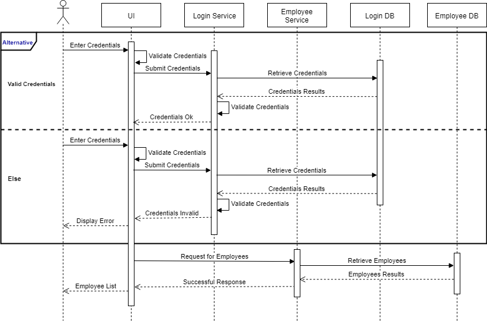
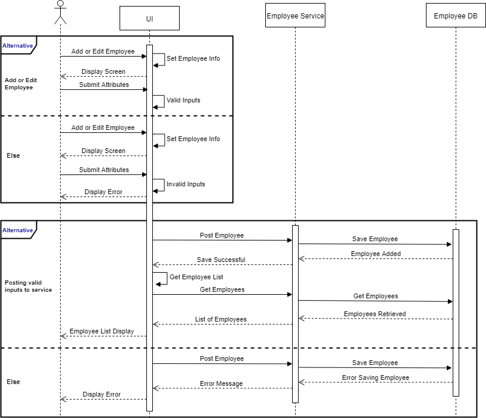

# Introduction
Hi, welcome to my full stack cloud project! Below you can find a list of all microservices involved in this project. This includes docker files, `docker-compose.yml` and kubernetes files deployed in a local minikube.

This is not a production project, is not elegantly styled, and does not live in the cloud (because that costs money and is very expensive!). This project just serves to demonstrate a *Proof of Concept* of my ability to develop full stack cloud microservices.

Thanks for visiting! There's a lot here, so please take your time.
[Shout out to me on LinkedIn!](https://linkedin.com/in/matthewpalmer9)

# Projects in this Repository

|Projects                 |Description                                          |
|-------------------------|-----------------------------------------------------|
|angular-ui               |`Angular UI Project`                                 |
|api-gateway              |`Spring Boot Zuul API Gateway Service`               |
|discovery-service        |`Spring Boot Eureka Discovery Service`               |
|employee-db-docker-image |`Contains Dockerfile for building MySQL Employee DB` |
|employee-service         |`Spring Boot Employee Service`                       |
|login-db-docker-image    |`Contains Dockerfile for building MySQL Login DB`    |
|login-service            |`Spring Boot Login Service`                          |
|registration-service     |`Spring Boot Employee Registration `                 |
|react-ui                 |`React UI`                                           |

# Sequence Diagrams

## Overview
> #
> 
> #

## Login
> #
> 
> #

## Add and Edit Employees
> #
> 
> #
